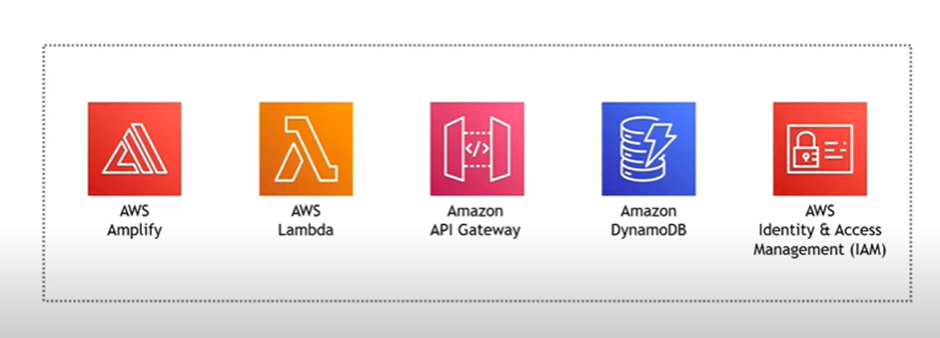
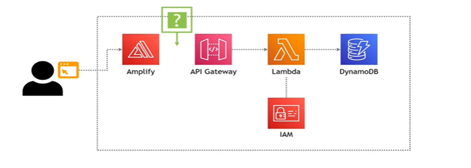
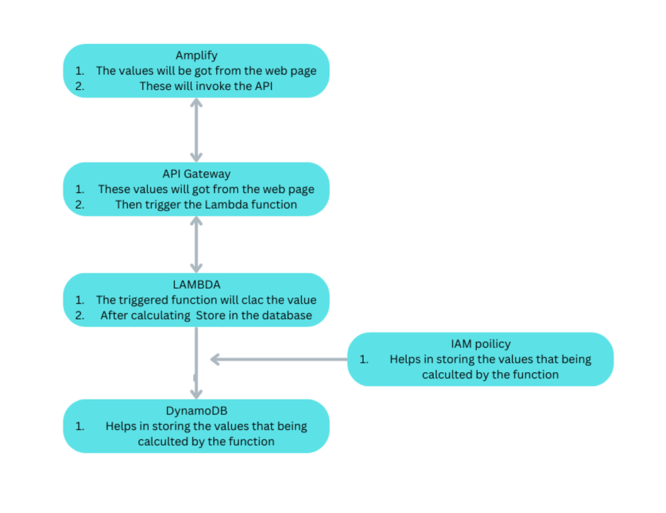

PROJECT TITLE: Power of Math
Sub: Hosting a static website in the using the AWS resources.
Author: Ramkumar R
Reference: https://youtu.be/7m_q1ldzw0U?si=68DJcBy3BDOOAcMx

Resources used:
• Amplify
• API gateway
• Lambda
• Dynamo DB
• IAM

By integrating all the resources, the static website to calculate the value of numbers with exponent
E.g. (2^5=32) by only getting the value of the base and the exponent values.

Architecture:

Step 1: Using the Amplify
• zip the HTML code that going to get the input values of the base and exponent.
• open the Amplify service in the AWS and host the web code int the service without using the GitHub or git lab.
• Go to the step 2.
o Returning from the Step 5.
o In the code include the “invoke URL” that copied from the REST API that deployed.
o Now it got integrated with the API gateway. The input values will trigger the API.
Step 2: Using the Lambda
• In lambda create the serverless function that execute when its triggered.
• Create new lambda python function that calculates the value using the Base & Exponent.
• Deploy the python code (if you need run your own test cases to check the code written).
• Go to the step 3.
o Returning from the step 4
o Go to the configuration in the lambda function and create the “inline policy “
o This inline policy is created by using the service IAM
o Go to the step 5.
Step 3: Using the API gateway
• Create a new REST API and make it to response to the POST requests that going to come from the web app that is hosted (Note: still it’s not integrated).
• Integrate the method / Lambda function (serverless function that created previously in
step 2) using the create method option.
• After enable the cores to and activate the post method to respond for the POST requests.
• Deploy the API in the new stage.
• Copy and save the “invoke URL” which is going to needed afterwards.
• Optional step: Now if you want test the flow test by manually entering the values and trigger the lambda function.
• Go to the Step 4.
Step 4: Using the Dynamo DB
• Create the table and copy the ARN (Amazon Resource Name)
• Use: To store the result from the lambda function this Database is created.
• Integrate the lambda and DynamoDB (Lambda  DynamoDB).

1. For this go to lambda.
2. Go to step 2.
   Step 5: Using the IAM policy
   • Write an inline policy template in JSON format
   • In that template paste the ARN of the DynamoDB that previously copied
   • Save the inline policy
   • Now the lambda and the DynamoDB is integrated, values or the results from the lambda function can now store in the database that got created.
   • Final part is to only integrate Hosted web app and the API gateway
   • Go to the step 1.
   FLOW CHART:

   
